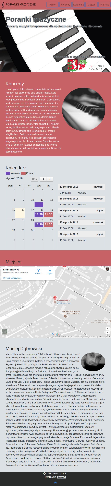

# pageMusic
### [Demo](http://rogala.it/pagemusic/)
Time realization: 10:20h.

| Change | time | total time |
| :---: | :-: | :-: |
| Initial design and stylization  | 3:30h | 3:30h |
| Install, configure and stylization fullcalendar | 1:40h | 5:10h |
| Fix problem with the google apps | 4:00h | 9:10h |
| Add color, baner and logo provided by the customer | 1:10h | 10:20h |


## How to build 
[Install gulp](https://github.com/leszek3737/Gulp-Config-Files)
and install:
```
npm install
```
Build application in developer mode

```
gulp build
```
Build application in production mode

```
gulp build::prod
```


## Screen
| Screen-full | Screen-tablet | Screen-mobile |
| :---: | :-: | :-: |
|  |  |  |


